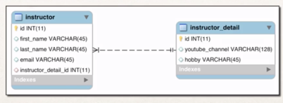
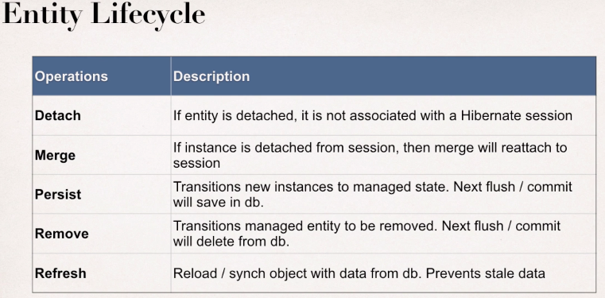
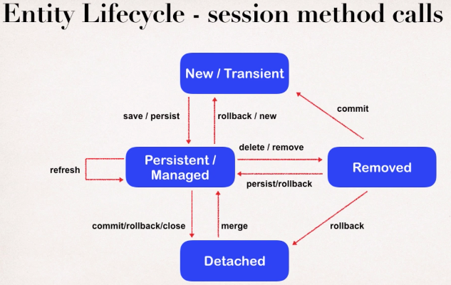

## **Hibernate Demo**

 **Primary Key** : Identify a unique row in a table.
 
**Foreign key** : Links tables together
              A field in one table that refers to primary key in another table.
              Referential integrity.
              Prevents the operations that would destroy relationship.
              Ensures only valid data inserted into foreign key column. 
              
 **Cascade** : Apply the same operation to related entities. If data update or delete in parent table
               should remove in the child too.
 
 **Data loading :**
 
    Eager : will retrieve everything.
 
    Lazy : will retrieve on request.
 
 **Relation ships**
 
 One to One --> Example Instructor --> Instructor details.
 
 
 
 **Entity Lifecycle**
 
  
  
  
  
  
 
 
