### SpringBoot Demo
**Pain points to build Mavan Spring Application**

 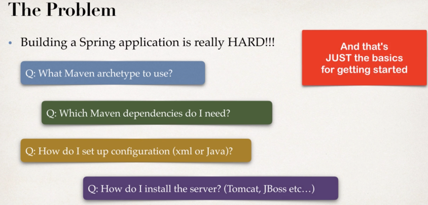
 
 **Spring Boot Solutions**

 
 
  **Spring Initilizr Details**

 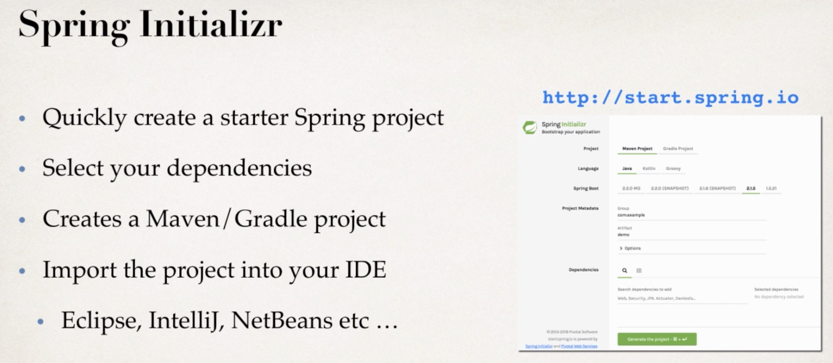
 
  **Maven Wrapper Files**

 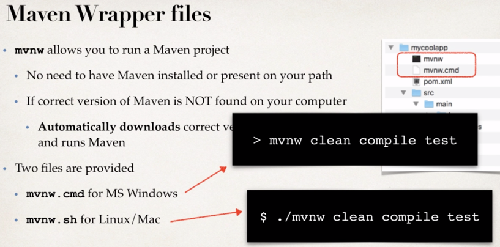
 
 **Spring Application Config**
 
  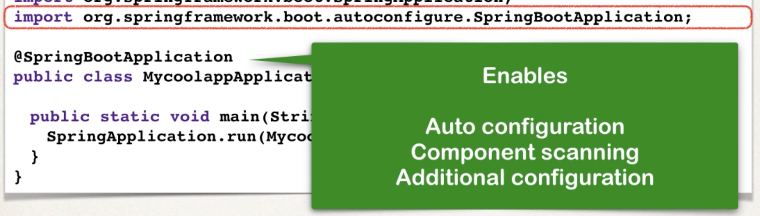
  
   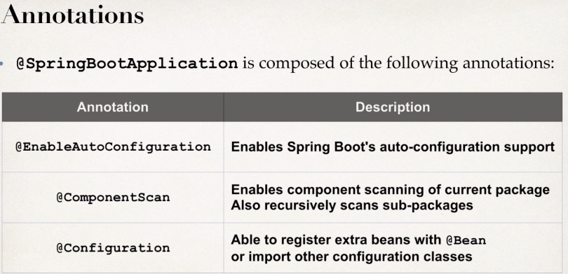
   
  **Spring boot strap**
 
  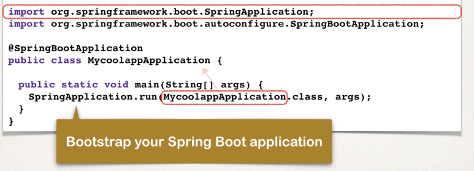
  
   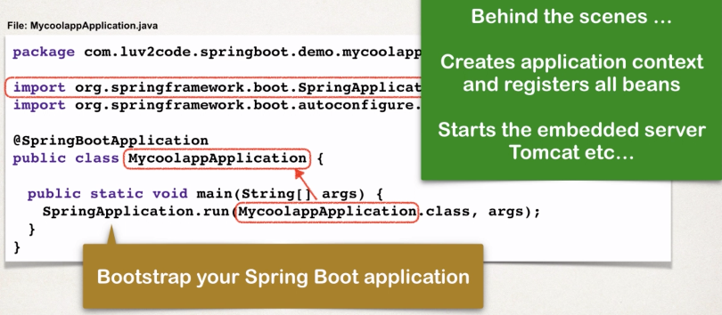
   
  **Spring Componant Scan**
 
  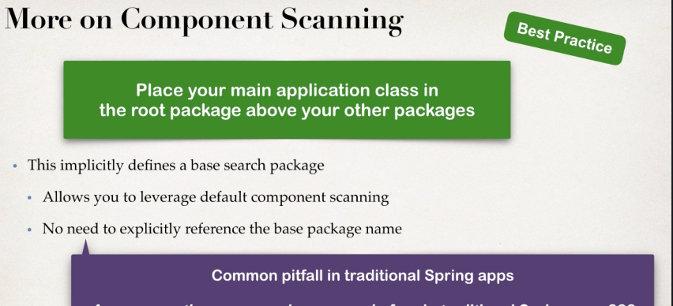
  
   
   
   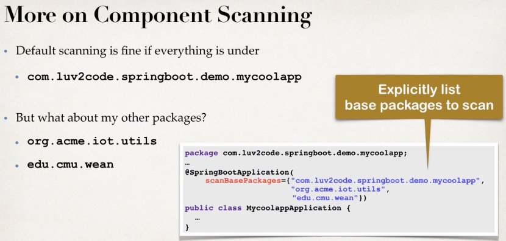
   
  **Spring Values from application Properties**
 
  
  
  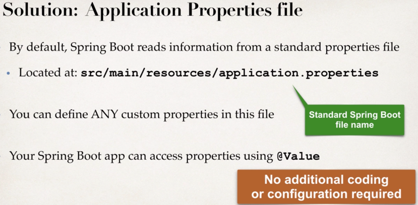
  
  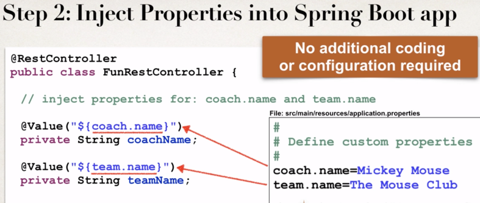
  
  **webapp info**
  
  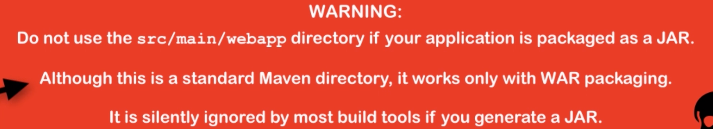
  
  **Spring Boot Advantages**
  
   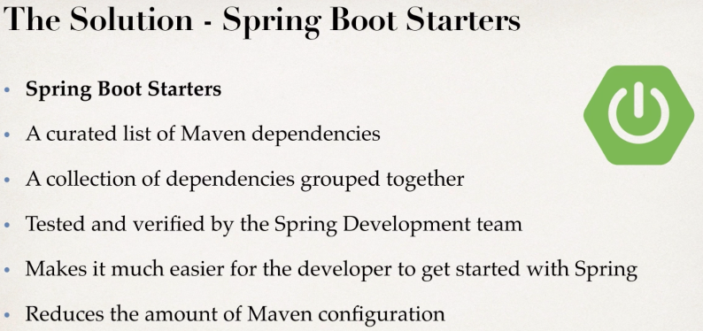
  
   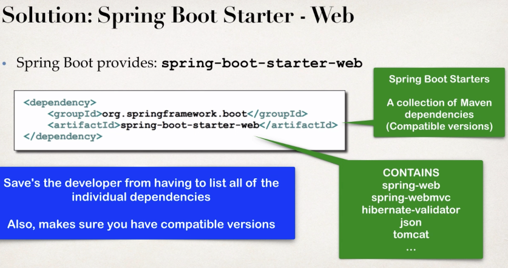
   
   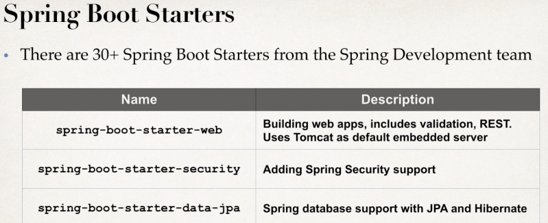
  
   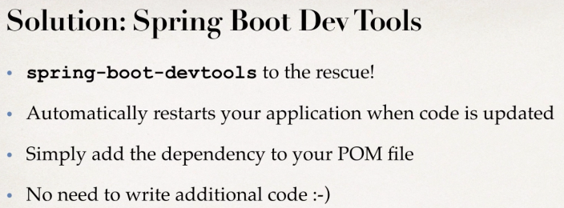
   
   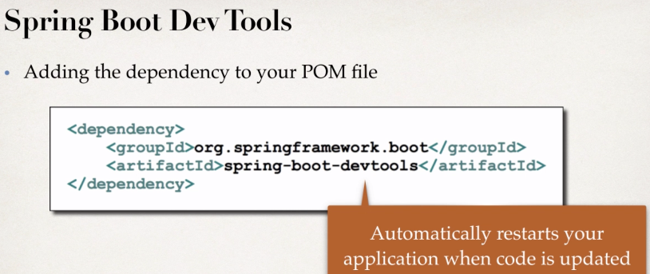
   
   **Spring Boot Actuator**
  
   
  
   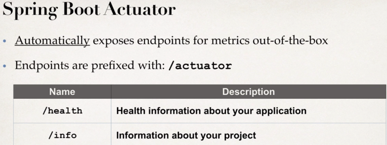
   
   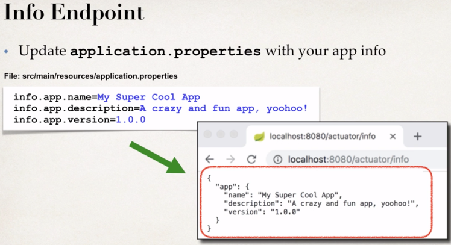
  
   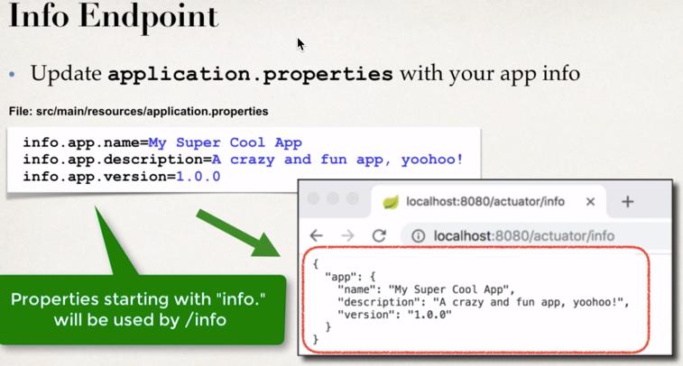
   
   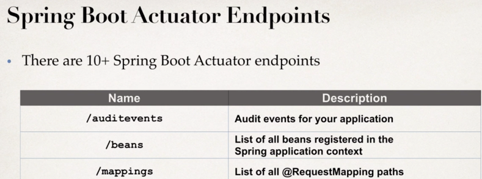
   
   
   
 
 ==============================================================
